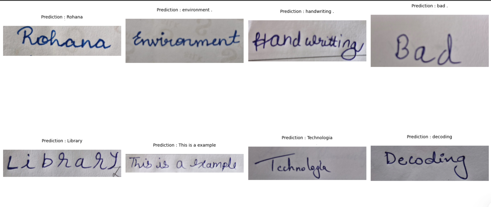
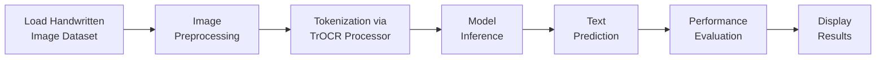

<div align="center">

# ✍️ Handwritten Text Recognition using Deep Learning

### Transformer-based OCR for Handwritten Word Recognition

[](https://www.python.org/)
[](https://pytorch.org/)
[](https://huggingface.co/docs/transformers)
[](https://jupyter.org/)
[](#-license)

A deep learning-based **Handwritten Text Recognition (HTR)** project built with Python and Jupyter Notebook, using a **Transformer-based OCR (TrOCR)** approach to recognize handwritten words from images — covering the full pipeline from preprocessing to prediction.

</div>

---

## 📖 Table of Contents

- [Overview](#-overview)
- [Features](#-features)
- [Sample Output](#️-sample-output)
- [Technology Stack](#️-technology-stack)
- [Repository Structure](#-repository-structure)
- [Project Workflow](#-project-workflow)
- [Installation](#-installation)
- [Example Predictions](#-example-predictions)
- [Requirements](#-requirements)
- [Future Improvements](#-future-improvements)
- [Author](#-author)
- [Support](#-support)

---

## 📌 Overview

**Handwritten Text Recognition (HTR)** is a computer vision task that converts images of handwritten text into machine-readable text. This project demonstrates an end-to-end HTR pipeline built around Microsoft's **TrOCR** (Transformer-based OCR) architecture, including:

- 🖼️ Image preprocessing and normalization
- ✍️ Handwritten word recognition
- 🧠 Deep learning–based prediction
- 📊 Visualization of prediction results
- ✅ Evaluation on handwritten text samples

---

## ✨ Features

| Feature | Description |
|---|---|
| ✅ Handwritten word recognition | Recognizes individual handwritten words from images |
| ✅ Image preprocessing | Normalizes and prepares images for model inference |
| ✅ Deep learning–based OCR | Uses a Transformer-based (TrOCR) model for prediction |
| ✅ Prediction visualization | Displays input images alongside predicted text |
| ✅ Notebook-based workflow | Clean, step-by-step Jupyter Notebook implementation |
| ✅ Easy to extend | Simple structure for adapting to new datasets |

---

## 🖼️ Sample Output

Below is an example prediction generated by the model:

<div align="center">

</div>

---

## 🛠️ Technology Stack

<div align="center">

| Category | Tools |
|---|---|
| **Language** | Python 3.x |
| **Deep Learning** | PyTorch |
| **OCR Model** | 🤗 Hugging Face Transformers, TrOCR |
| **Image Processing** | OpenCV, Pillow |
| **Data Handling** | NumPy, Pandas |
| **Visualization** | Matplotlib |
| **Environment** | Jupyter Notebook |

</div>

---

## 📂 Repository Structure

```
Handwritten-Text-Recognition/
│
├── Handwritten_text_recog.ipynb   # Main notebook — full HTR pipeline
├── output.png                     # Sample prediction output image
├── requirements.txt                # Project dependencies
└── README.md                       # Project documentation
```

---

## 📊 Project Workflow



1. **Load** the handwritten image dataset
2. **Preprocess** images (resizing, normalization)
3. **Tokenize** inputs using the TrOCR Processor
4. **Run inference** with the deep learning model
5. **Generate** text predictions
6. **Evaluate** model performance
7. **Display** prediction results

---

## 📦 Installation

**1. Clone the repository**
```bash
git clone https://github.com/Kruthik-JP/Handwritten-Text-Recognition.git
```

**2. Move into the project folder**
```bash
cd Handwritten-Text-Recognition
```

**3. Install dependencies**
```bash
pip install -r requirements.txt
```

**4. Launch Jupyter Notebook**
```bash
jupyter notebook
```

**5. Open the notebook**
```
Handwritten_text_recog.ipynb
```

**6. Run all cells** to execute the full pipeline.

---

## 📈 Example Predictions

| Input | Predicted Text |
|:---:|:---:|
| Handwritten Word | `Rohana` |
| Handwritten Word | `Environment` |
| Handwritten Word | `Handwriting` |
| Handwritten Word | `Library` |
| Handwritten Word | `Decoding` |

---

## 📋 Requirements

Full list available in [`requirements.txt`](requirements.txt). Main libraries include:

```
torch
torchvision
transformers
datasets
evaluate
jiwer
opencv-python
Pillow
numpy
pandas
matplotlib
```

---

## 🚀 Future Improvements

- [ ] Sentence-level recognition
- [ ] Custom dataset fine-tuning
- [ ] Real-time handwritten text recognition
- [ ] Web application using Streamlit or Flask
- [ ] Model optimization for faster inference
- [ ] Multi-language handwritten text recognition

---

## 👨‍💻 Author

**Kruthik JP**
*Software Engineer | Artificial Intelligence & Machine Learning*

[](https://github.com/Kruthik-JP)

---

## ⭐ Support

If you found this project useful, consider giving it a **⭐ star** on GitHub — it helps others discover the project and motivates further development!

<div align="center">

Made with ❤️ and 🧠 by [Kruthik JP](https://github.com/Kruthik-JP)

</div>
